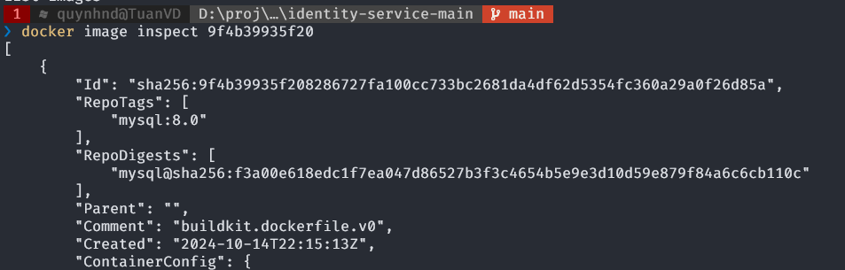
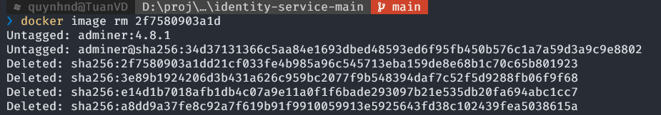
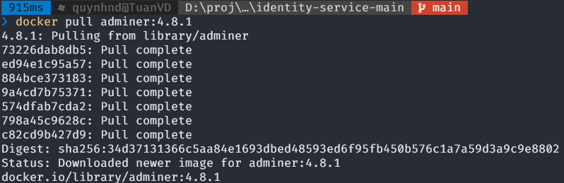

# Important Docker commands
## 1. `docker images`
To list all the docekr images present in the docker server

## 2. `docker images inspect [image-id]`
Display detailed image infor for a given id

 
 `docker image inspect [repository:tag]`--> `docker image inspect mysql:8.0`
## 3. `docker image rm [image-id]`
Remove image 

## 4. `docker pull [repository:tag] `

## 5. `docker build . -t [image-name]`
Generate a docker image based on a Dockerfile

`docker build -t identity-service:0.0.1 .`

## 6. `docker run -p [hostport]:[containerport] [image-name]`
Start docker container

`docker run --network quynh-network --name mysql -p 3306:3306 -e MYSQL_ROOT_PASSWORD=root -d mysql:8.0`
## 7. `docker ps`
Show all running container

`docker ps -a`

`docker ps --format "table {{.ID}}\t{{.Status}}\t{{.Names}}"`

`docker ps --format '{{ .ID }} {{ .Names }} {{ json .Networks }}'`
## 8. `docker container start [container-id]`

`docker container pause [container-id]`

`docker container unpause [container-id]`

`docker container stop [container-id]`

`docker container kill [container-id]`
## 9. `docker container inspect [container-id]`

`docker inspect --format='{{range .Config.Env}}{{println .}}{{end}}' 575ed3040056 `

## 10. `docker container logs [container-id]`

 
## 11. `docker exec -it [container-id] sh`
Open a sell inside a running container

## 12. `docker [...] prune`
Remove all 
`docker container prune`
## 13. `docker compose up`
`docker compose up -d --build -f docker-compose-sub.yaml `

# Material
 [docker-ghichep](https://docker-ghichep.readthedocs.io/en/latest/lenh-docker/)

 [docker-handbook.farhan.dev](https://docker-handbook.farhan.dev/container-manipulation-basics/)