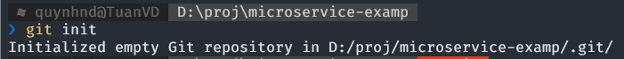
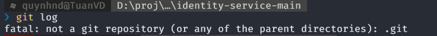
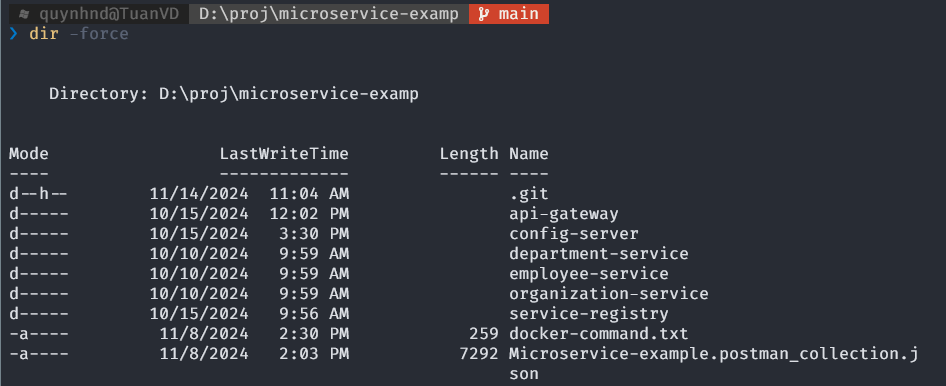
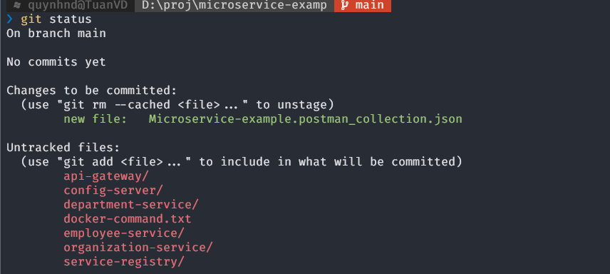
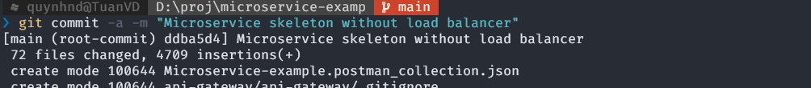
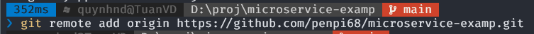
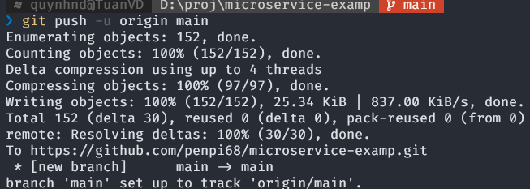

### Create a git repo
#### Go to foler directory
`cd D:\proj\mcroservice-examp`

#### Git help
`git command -help` -  See all the available options for the specific command

`git help --all` -  See all possible commands
#### Initialize Git
`git innit`

+ ~~Before~~ 
+ After 

#### Add file to repo
`git add Microservice-example.postman_collection.json`

`git status`

`git add -all`

+ Remove Added Files in Git `git reset <file>`

#### Commit git
Adding commits keep track of our progress and changes as we work. Git considers each commit change point or "save point". It is a point in the project you can go back to if you find a bug, or want to make a change.

 we should always include a message.

By adding messages, easy to see what has changed and when.

`git commit -a -m "   "`

#### Connext to github

`git remote add origin URL`

#### Push local to online repo from main branch 
`git push -u origin main`

#### Pulling to keep up-to-date 
working as a team on a project,important that everyone stays up to date.

Any time you start working on a project, you should get the most recent changes to your local copy.

`git diff origin/master` :verify by showing the differences between our local master and origin/master:

pull is a combination of 2 different commands:

+ fetch: fetch gets all the change history of a tracked branch/repo.
`git fetch origin`
+ merge: merge combines the current branch, with a specified branch.
`git merge origin/master`

`git pull origin` used to pull all changes from a remote repository into the branch you are working on.

#### Create new branch
+ And confirm which branches we have, and where we are working at the moment:`git branch`
+  see all local and remote branches: `git branch -a`

`git checkout -b update-readme`