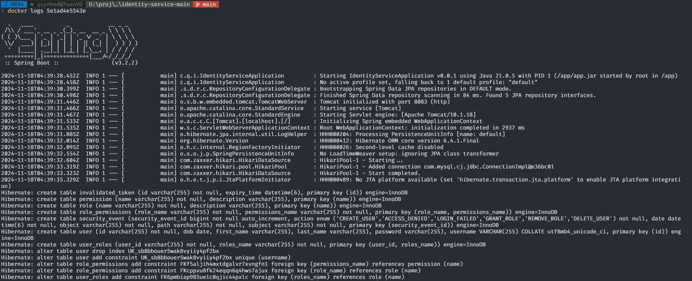

# Docker guideline for identity-service

### Create init folder inside proj folder
+ Create init.sql file to create a database 

### Build images and run with docker-compose

`docker compose up -d --build`

### Check database using adminer
`Start-Process "http://localhost:9080"`

### Inspect network

### Open mysql shell inside container
`docker exec -it [container-id] sh`

`mysql -u root -p`

### Application startup log

`docker log [container-id]`

 

## Docker guildline with subnet
